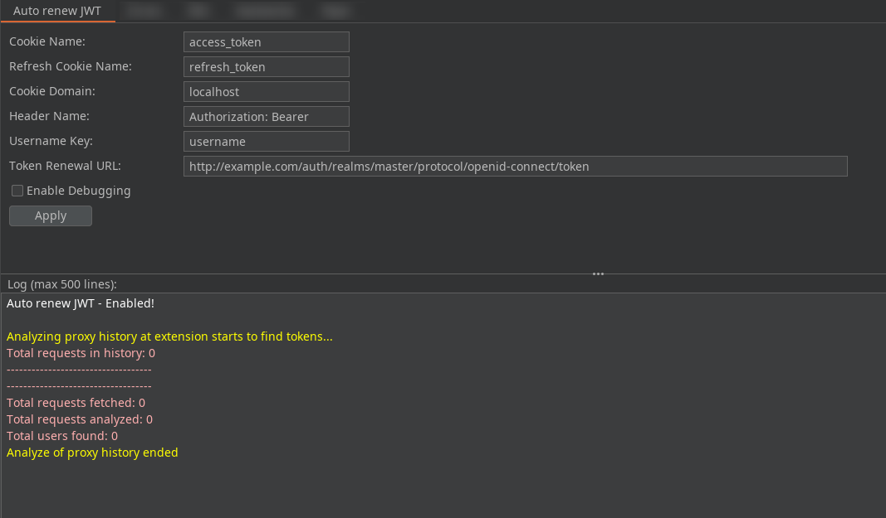
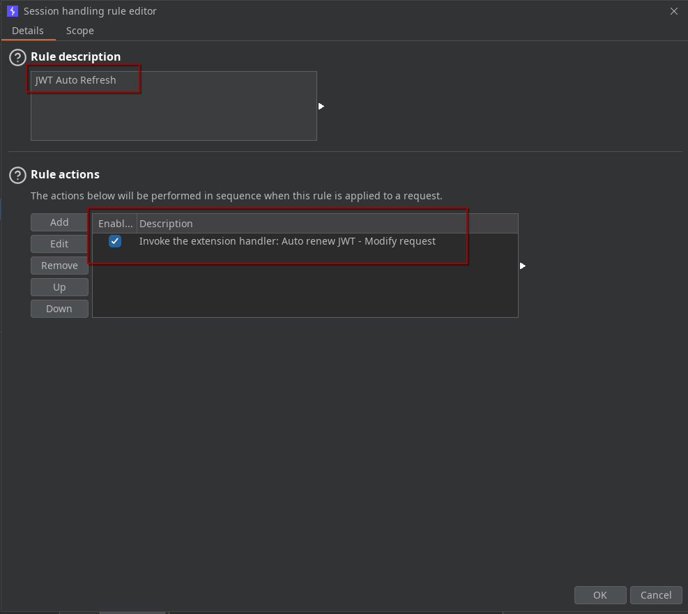
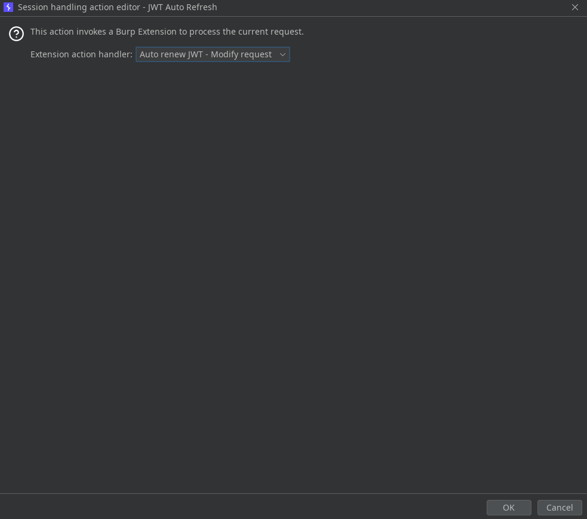
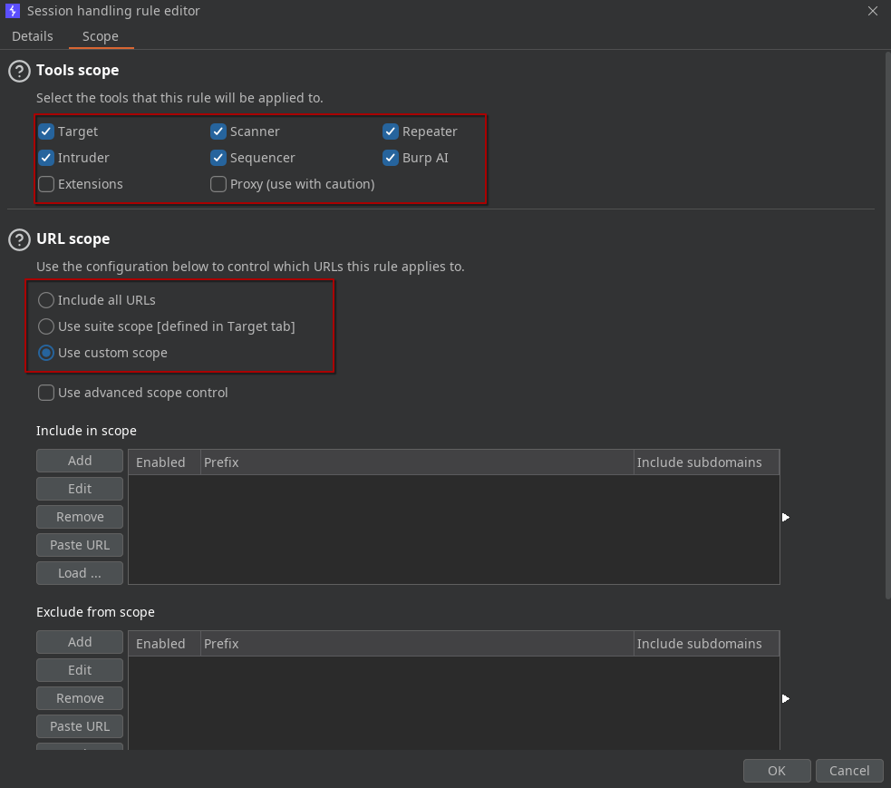

# JWT AutoRenew & Multi-User Handler

A Burp Suite extension for seamless JWT renewal and advanced multi-user session handling.

## Overview

**JWT AutoRenew & Multi-User Handler** is a Burp Suite extension designed to automate the renewal of short-lived JWT access tokens using refresh tokens. It ensures uninterrupted security testing by preventing 401 errors due to token expiration, and provides advanced features for multi-user authorization testing.

This extension is a complete rewrite and consolidation of the original [BurpExtension-JWT-4-session-handling](https://github.com/V9Y1nf0S3C/BurpExtension-JWT-4-session-handling), with a modern, user-friendly interface and enhanced capabilities.

## Key Features

- **Automatic JWT Renewal:**  
  - Detects expired JWT tokens in outgoing requests.
  - Uses the refresh token to obtain a new JWT via a configurable renewal URL.
  - Updates the Authorization header in the request with the new token.

- **Multi-User Support:**  
  - Extracts a user identifier (configurable key, e.g., `username`) from the JWT payload.
  - Stores JWT and refresh tokens in Burp's cookie jar, using a user-specific path (`/username`).
  - Manages multiple tokens for different users in parallel.

- **Session Handling Rules Integration:**  
  - Fully compatible with Burp Suite's Session Handling Rules.
  - Works with all Burp tools (Scanner, Repeater, Intruder, Proxy, etc.).
  - Designed for use with [Auth Analyzer](https://github.com/simioni87/auth_analyzer) for vertical and horizontal authorization testing.

- **Automatic Proxy History Analysis:**  
  - On extension startup, analyzes the proxy history to detect and store existing tokens for each user.

- **Advanced Cookie Management:**  
  - Create, update, delete, and retrieve custom cookies for each user.

- **Highly Configurable:**  
  - Customizable JWT and refresh token variable names.
  - Custom cookie domain.
  - Custom authorization header name (e.g., Bearer ...).
  - Custom JWT payload key for user identification.
  - Custom token renewal URL.
  - Debug mode for detailed logging.

- **User-Friendly GUI:**  
  - Dedicated Burp Suite tab with:
    - Configuration fields for all parameters.
    - Real-time log area with autoscroll and line limit.
    - Apply button for configuration changes.
    - Status messages and debug information.

- **Advanced Debugging:**  
  - Enable debug mode to display detailed logs of all internal operations.
  - Error reporting for decoding, renewal, and configuration issues.

- **Theme Support:**  
  - Automatically adjusts interface and log colors for Burp Suite's dark or light theme.

## Usage

1. **Install the extension** in Burp Suite (Extender > Extensions).
2. **Configure the options** in the "JWT AutoRenew & Multi-User Handler" tab:
   - Set the names for the access and refresh tokens, cookie domain, authorization header, user key, and token renewal URL.
   - Enable debug mode for detailed logs if needed.
   

     
   

3. **Define Session Handling Rules** to apply the extension's actions to your desired scope (Scanner, Repeater, Intruder, etc.).
   - Session handling (Main session window)
   

     
   

   - Session handling action (Link session to JWT Auto Renew extension)
   

     
   

   - Session handling Scope (Restrict extension to your desired tools & URL scope)
   

     
   

4. **Start your tests**. The extension will automatically handle token renewal and user session management.

## Example Use Cases

- **Automated Scanning:**  
  Prevents Burp Scanner from failing due to expired tokens by auto-renewing JWTs in the background.

- **Manual Testing:**  
  Seamlessly updates tokens in Repeater, Intruder, and other Burp tools.

- **Authorization Testing (with Auth Analyzer):**  
  Combine this extension with [Auth Analyzer](https://github.com/simioni87/auth_analyzer) to test access control for multiple users. For example:
  - Configure several users in Auth Analyzer: one or more authenticated users (with valid JWTs) and one unauthenticated user (no token or an invalid token).
  - Use the extension to manage and renew tokens for each user automatically.
  - As an admin, navigate through the application to collect admin-level tokens. The extension will store these tokens per user in the cookie jar.
  - With Auth Analyzer, replay requests as different users to verify vertical (admin vs. user) and horizontal (user vs. user) authorization controls, ensuring that only authorized users can access sensitive resources.

## Future Enhancements

- **Headless Browser Auto-Login:**  
  Integration with headless browser login (see `jwt_4B_Chrome_Headless_AutoLogin.py` from [forked files](https://github.com/psyray/JWT-AutoRenew-Multi-User-Handler/blob/forked-files/jwt_4B_Chrome_Headless_AutoLogin.py)) is planned for future releases, to automate initial authentication and token retrieval.

## Credits

- Original concept and codebase: [V9Y1nf0S3C/BurpExtension-JWT-4-session-handling](https://github.com/V9Y1nf0S3C/BurpExtension-JWT-4-session-handling)
- Multi-user and authorization testing inspiration: [simioni87/auth_analyzer](https://github.com/simioni87/auth_analyzer)

## License

[GPL v3](LICENSE) - feel free to use this project for your security needs.

---

**For questions, suggestions, or contributions, please open an issue or pull request.**
